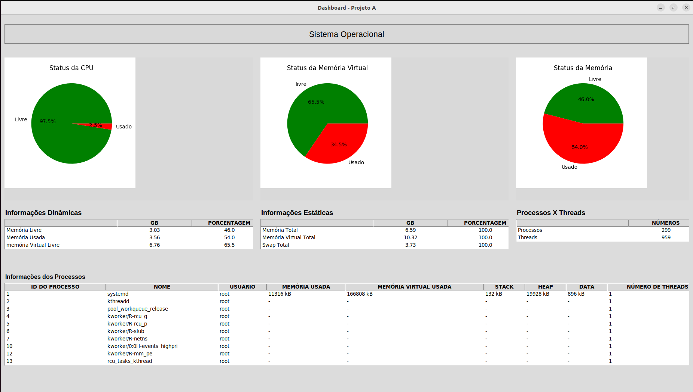

<h1 align=center>Dashboard</h1>
Esse diretório contém o projeto desenvolvido na matéria de Sistemas Operacionais, onde o objetivo era desenvolver um dashboard para Linux que mostrasse as informações do sistema, realizando a coleta usando apenas API do mesmo e com a implementação de threads.

 

## Conteúdos
O projeto foi desenvolvido usando o padrão MVC, como resultado temos:
- **data_collector.py** - Equivalente ao Model, responsável pelas coletas de dados do sistema operacional;
- **interface.py** - Equivalente ao View, parte visual do programa;
- **controller.py** - Responsável pela gerência de dados e transferência do Model para o View;
- **Makefile** - Criado para rodar de forma simplificada pelo terminal.

## Pré-requisitos
- Python;
- Pip (instalador de pacotes do python);
- Matplotlib.

## Execução
Após confirmar que possui todos os pré-requisitos listados anteriormente instalados, abra o terminal no diretório do projeto e digite:

```bash
make
```
